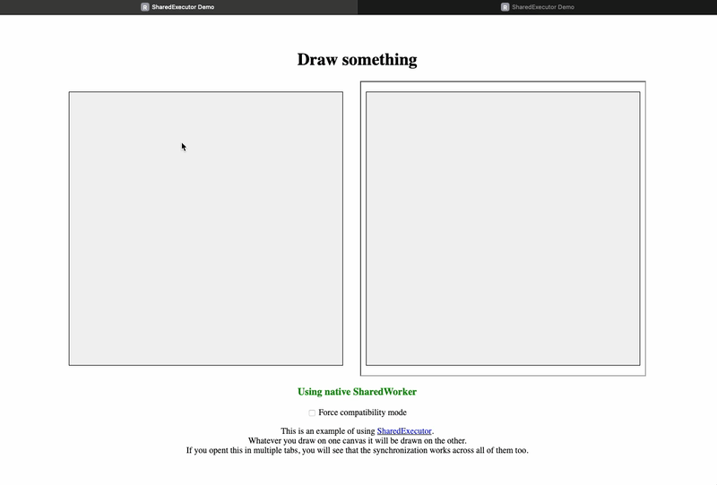

# Shared Executor

An experimental library that creates a single executor shared across multiple browsing contexts (tabs, iframes) to run shared logic once and broadcast results to all contexts. 

It can be used to optimize performance, share resources, and synchronize state.

## How it works

- **Native path**: If the [SharedWorker API](https://developer.mozilla.org/en-US/docs/Web/API/SharedWorker) is available, the Shared Executor is a thin wrapper around it.
- **Fallback path**: If the [SharedWorker API](https://developer.mozilla.org/en-US/docs/Web/API/SharedWorker) is not available or the worker is started with the `forceCompat: true` option , it spawns individual web workers that cooperatively elect a master. All calls are forwarded to this master, emulating a shared worker.



## Usage

### in the Worker

```javascript
// 1. import `sharedexecutor/SharedExecutor.js` in your worker  
import SharedExecutor from './sharedexecutor/SharedExecutor.js';

// 2. instantiate it
const executor = new SharedExecutor(async (isMaster) => {
    if (isMaster) {
        // code that runs when this worker is the master 
        //  ie. put your initialization logic here
        console.log("Master worker started");
    } else {
        // code that runs when this worker releases the master role
        //  ie. put your deinitialization logic here (if needed)
        console.log("Worker connected to master");
    }
});

// 3. bind all the client comunication stuff, this will make the SharedExecutorClient work
executor.bindToClient();

// 4. register the methods you want to expose to the clients (RPC style)
executor.registerMethod('hello', (...args) => {
    console.log('Hello world!');
    
    // from anywhere in your code you can trigger a callback that will be sent to all clients
    // clients can register any callback they want to receive using SharedExecutorClient
    // executor.triggerCallback('myCallbackName', "something something args ");


    return `Hello from the worker! Args: ${args.join(', ')}`; // the return value will be sent back to the client
}); 

```


### in the main javascript file

```javascript
// 1. import `sharedexecutor/SharedExecutorClient.js` in your main javascript file
import SharedExecutorClient from './sharedexecutor/SharedExecutorClient.js';

// 2. instantiate it, passing the worker file path and options
const executor = new SharedExecutorClient('worker.js', { 
    type: 'module' , 
    // forceCompat: true  // uncomment this if you want to force the compat mode even if the SharedWorker API is available (mostly for debug)
});


// 3. register callbacks if you need them
// executor.registerCallback('myCallbackName', (arg) => {
//     console.log(arg); // this will be called when the worker triggers a callback with the same name
// });

// 4. call methods registered in the worker
executor.invoke('hello')
    .then(result => {
        console.log('Result from worker:', result); // this will log the return value from the worker
    })
    .catch(error => {
        console.error('Error calling worker method:', error);
    });
```


### Demo

A demo is available [here](https://rblb.it/sharedexecutor-js).

You can open it in multiple tabs and you will see that whatever you draw in the canvas is synchronized across all tabs.
